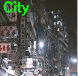
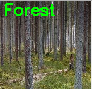

# Classify Environment Images using Lenet Neural Net Architecture
Convolutional neural network using LeNet architecture to classify a picture into 4 environment categories: forest, ocean, mountain, city. This uses Keras with tensorflow backend and is written in Python.  
Around 800 labeled sets of pictures per each category, giving a total of 3200 total sets for training and testing. Labelled sets were scraped from google images and processed with OpenCV.  
First attempt of the model gave an accuracy of 61.47% in 20 epochs.  
This model will be further improved in the future when I have access to a GPU.  

## Use:
To use, run: `python3 lenet_driver.py [options]`  
>Options:  
    -s, --save-model    Flag to train and save a model  
    -l, --load-model    Flag to load an already trained model  
    -w, --weights       Filename of the weights file for the already trained model. (Must be in output directory and hdf5 extension)  

### First attempt:
  

#### Sample Classification
 
city=73.03%, forest=2.20%, mountain=24.66%, ocean=0.11%
  
 
city=2.09%, forest=97.05%, mountain=0.80%, ocean=0.06%
  
 
city=0.07%, forest=1.28%, mountain=0.03%, ocean=98.62%